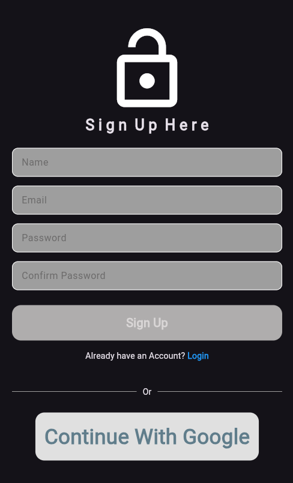
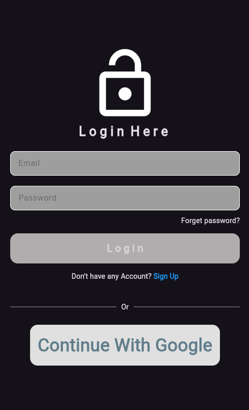
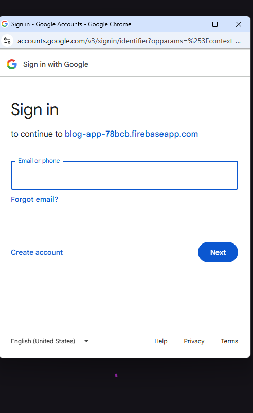
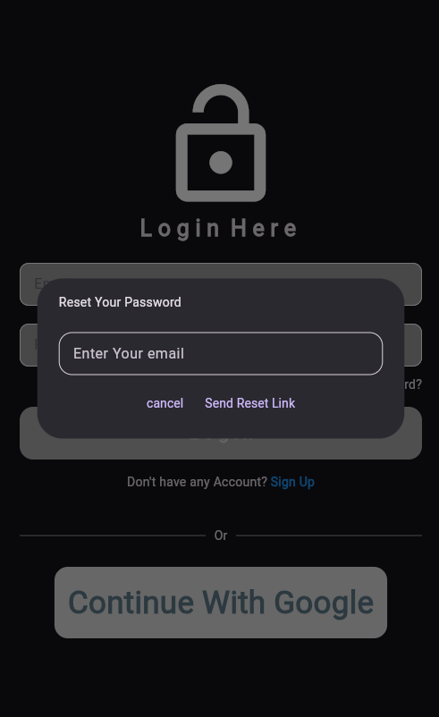
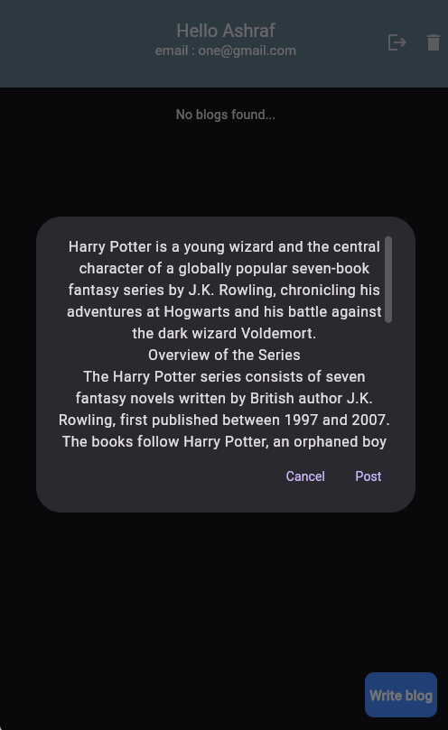
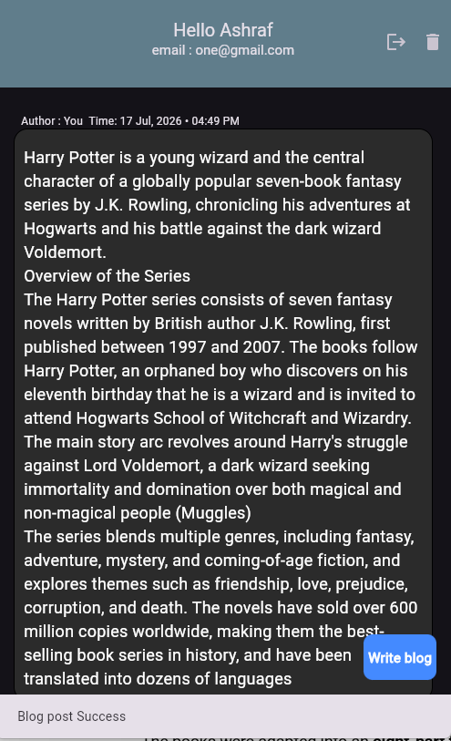

#  Blog posting App

A modern, high-performance Flutter application built to read, write, and manage blog posts seamlessly. The app leverages Firebase for secure user authentication and Cloud Firestore as a real-time reactive backend database.

---
<table align="center">
  <tr>
    <td align="center">
       
      <b>Email-signup</b>
    </td>
    <td align="center">
       
      <b>Email-Login</b>
    </td>
    <td align="center">
       
      <b>Write Blog</b>
    </td>

  <tr>
   <td align="center">
       
      <b>PasswordReset</b>
    </td>
   <td align="center">
       
      <b>Blog-feed</b>
    </td>
   <td align="center">
       
      <b>App-view</b>
    </td>
  </tr>
</table>

##  Features

- **Google Authentication:** Secure and easy one-click sign-in using Google Authentication (`Firebase Auth` & `google_sign_in`), optimized for both Web (Popup) and Mobile environments.
- **Real-time Blog Feed:** Instantly streams and syncs blog posts directly from `Cloud Firestore`.
- **Elegant Timestamp Formatting:** Utilizes the `intl` package to convert raw database timestamps into highly readable, user-friendly formats.
- **State Management: ** Managed state usign Bloc With Clean Architechture

---

## Packages
- **Backend Services:** [Firebase Core](https://pub.dev/packages/firebase_core)
- **Authentication:** [Firebase Auth](https://pub.dev/packages/firebase_auth) & [Google Sign-In](https://pub.dev/packages/google_sign_in)
- **Database:** [Cloud Firestore](https://pub.dev/packages/cloud_firestore)
- **Utilities:** [Intl Package](https://pub.dev/packages/intl) (For Date & Time Parsing)
- **State Management:** [Bloc](https://pub.dev/packages/flutter_bloc)

---

##  Getting Started

Follow these instructions to get the project up and running on your local machine.

### 1. Clone the Repository

git clone [https://github.com/ashrafCharlie/Blog-Posting-App.git](https://github.com/ashrafCharlie/Blog-Posting-App.git)

### 2. write this command on your Terminal
cd blog_app
